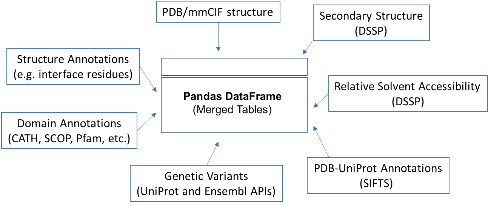

# ProIntVar
ProIntVar-Core is a Python module that implements methods for working with protein structures (handles mmCIF, DSSP, SIFTS, protein interactions, etc.) and genetic variation (via UniProt and Ensembl APIs).

ProIntVar core is now separated from ProIntVar-Analysis, which contains analysis scripts that use ProIntVar Core components.


## Table of Contents

- [Key features](#key-features)
- [Overview](#overview)
- [Dependencies](#dependencies)
- [Installing](#installing)
- [Configuration](#configuration)
- [How to use](#how-to-use)
  - [ProIntVar CLI](#prointvar-cli)
  - [ProIntVar Classes](#prointvar-classes)
- [Additional Information](#additional-information)
  - [Project Structure](#project-structure)
  - [Guidelines on file names and extensions](#guidelines-on-file-names-and-extensions)
- [Licensing](#licensing)


## Key features

* Support for both reading and writing [PDB/mmCIF](http://mmcif.wwpdb.org/) structures
* [DSSP](http://swift.cmbi.ru.nl/gv/dssp/) runnning and parsing
* PDB-UniProt structure-sequence mapping with [SIFTS](http://www.ebi.ac.uk/pdbe/docs/sifts/index.html) (xml) parsing
* Interface (contacts) computing and analysis with [Arpeggio](http://biosig.unimelb.edu.au/arpeggioweb/)
* Addition of Hydrogen atoms with [HBPLUS](http://www.ebi.ac.uk/thornton-srv/software/HBPLUS/) and [Reduce](http://kinemage.biochem.duke.edu/software/reduce.php)
* Download various raw files (structures, sequences, variants, etc.)
* Fetch data from several APIs (Proteins API, PDBe REST API, Ensembl REST, etc.)
* A TableMerger class that simplifies working with protein structures and sequence annotations
* All data is handled with [Pandas](http://pandas.pydata.org/) data structures


## Overview

ProIntVar handles data with aid of Pandas DataFrames. Data such as protein structures (sequence and atom 3D coordinates) and respective annotations (from structural analysis, e.g. interacting interfaces, secondary structure and solvent accessibility), as well as protein sequences and annotations (e.g. genetic variants, and other functional information) are handled by the classes/methods so that each modular (components) table can be integrated onto a single 'merged table'.




The methods implemenented in `prointvar/merger.py` allow for the different components to be merged together onto a single Pandas DataFrame.

## Dependencies
Using Python 3.5+.

Check [requirements.txt](./requirements.txt) for all dependencies.


## Installing

Setting up a virtual environment
```sh
$ virtualenv --python `which python` env
$ source env/bin/activate
```

Installing ProIntVar

```sh
$ wget https://github.com/bartongroup/ProIntVar-Core/archive/master.zip -O ProIntVar-Core.zip
$ unzip ProIntVar-Core.zip

# alternatively
$ git clone https://github.com/bartongroup/ProIntVar-Core.git

# installing requirements
$ cd ProIntVar-Core
$ pip install -r requirements.txt

# then...  
$ python setup.py test
$ python setup.py install
```


## Configuration

Editing the provided template configuration settings
```sh
$ cd /path/to/desired/working/dir/

# Get a copy of the template config.ini file shipped with ProIntVar
$ ProIntVar-Core-config-setup new_config.ini

# Update the settings according to user preferences and push them
$ ProIntVar-Core-config-load new_config.ini
```

Testing that the new values are correctly loaded by ProIntVar
```sh
$ python
>>> from prointvar.config import config
>>> config.db_tmp
'tmp'
```


## How to use

### ProIntVar CLI

There are several tools provided with the ProIntVar CLI, each having its own options and arguments. Pass the `--help` for more information about each tool.

An example usage of the CLI is to download some files from main repositories. Using the Downloader interface in the CLI to download some macromolecular structures:

```sh
# downloads structures in mmCIF format to the directory defined in the config.ini
ProIntVar download --mmcif 2pah
# downloads SIFTS record in XML format
ProIntVar download --sifts 2pah
```

### ProIntVar Classes

Each main class in ProIntVar works as an independent component that can be used on its own or together with other classes. Generally each main class produces/parses data to a pandas DataFrame. The classes/methods provided in `prointvar.merger` can be used to merge DataFrames. Merging DataFrames is not trivial, since there must be common features in the tables to be merged.
More information on how to use the `TableMerger` class and which features (columns) from each table can be used to merge with confidence is provided [below](#table-merger).

#### `prointvar.pdbx`

Using PDBXreader to parse a mmCIF formatted macromolecular structure.
```python

import os
from prointvar.config import config as cfg
from prointvar.pdbx import PDBXreader
from prointvar.fetchers import download_structure_from_pdbe

download_structure_from_pdbe('2pah')
input_struct = os.path.join(cfg.db_root, cfg.db_pdbx, '2pah.cif')
df = PDBXreader(inputfile=input_struct).atoms(format_type="mmcif")
# pandas DataFrame
df.head()

```

We can convert the format of the mmCIF structure to PDB format.
```python

from prointvar.pdbx import PDBXwriter

output_struct = os.path.join(cfg.db_root, cfg.db_pdbx, '2pah.pdb')
w = PDBXwriter(outputfile=output_struct)
w.run(df, format_type="pdb")

```

#### `prointvar.dssp`

With the DSSP classes we can read DSSP formatted files and also generate DSSP output for mmCIF or PDB structures.

```python

from prointvar.dssp import DSSPrunner, DSSPreader

input_struct = os.path.join(cfg.db_root, cfg.db_pdbx, '2pah.cif')
output_dssp = os.path.join(cfg.db_root, cfg.db_dssp, '2pah.dssp')
DSSPrunner(inputfile=input_struct, outputfile=output_dssp).write()

df2 = DSSPreader(inputfile=output_dssp).read()
# pandas DataFrame
df2.head()

```

#### `prointvar.sifts`

Parsing the SIFTS UniProt-PDB cross-mapping is as simple.

```python

from prointvar.sifts import SIFTSreader
from prointvar.fetchers import download_sifts_from_ebi

download_sifts_from_ebi('2pah')
input_sifts = os.path.join(cfg.db_root, cfg.db_sifts, '2pah.xml')
df3 = SIFTSreader(inputfile=input_sifts).read()
# pandas DataFrame
df3.head()

```

#### `prointvar.merger`

Now protein structure, secondary structure and solvent accessibility can be merged onto protein sequence (via SIFTS).

```python

from prointvar.merger import TableMerger

mdf = TableMerger(pdbx_table=df, dssp_table=df2, sifts_table=df3).merge()
# pandas DataFrame
mdf.head()

```


## Additional Information

### Table merger

TODO

### Project Structure

TODO

### Guidelines on file names and extensions
**PDB/PDBx/mmCIF Macromolecular structures**
* PDB and mmCIF formatted files are read and written from `db_pdbx` folder, as defined in the configuration file `config.ini`
    - PDB/mmCIF files are written as `<pdb_id>.pdb` or `<pdb_id>.cif`
    - BioUnits from PDBe are written as `<pdb_id>_bio.cif`
    - New structure files written for running DSSP, Reduce, HBPLUS or Arpeggio are generally written as `<4char>_new.pdb` format
    - By-chain/entity structures are written as `<pdb_id>_<chain_id>.pdb`

**DSSP Secondary Structure**
* DSSP files are read and written from `db_dssp` folder  
    - DSSP files are generally written as `<pdb_id>.dssp`
    - By-chain/entity DSSP outputs are written as `<pdb_id>_<chain_id>.dssp`
    - Unbound-state DSSP are written as `<pdb_id>_unbound.dssp`

**SIFTS Structure-Sequence (PDB-UniProt) cross-reference**
* SIFTS files are read and written from `db_sifts` folder
    - SIFTS files are written as `<pdb_id>.xml`

**Arpeggio Interface Contacts**
* Arpeggio files are read and written from `db_contacts` folder
    - Arpeggio files are written as `<pdb_id>.contacts`, `<pdb_id>.amam`, `<pdb_id>.amri`, `<pdb_id>.ari` and `<pdb_id>.ri`

**HBPLUS Hydrogen-Bond Contacts**
* HBPLUS files are read and written from `db_contacts` folder
    - HBPLUS files are written as `<pdb_id>.h2b`
    - HBPLUS Hydrogen-filled PDBs are written as `<pdb_id>.h.pdb` in `db_pdbx`

**Reduce PDBs filled with Hydrogen**
* Reduce files are read and written from `db_pdbx` folder
    - Reduce Hydrogen-filled PDBs are written as `<pdb_id>.h.pdb` in `db_pdbx`


## Licensing
The MIT License (MIT). See [license](LICENSE.md) for details. 