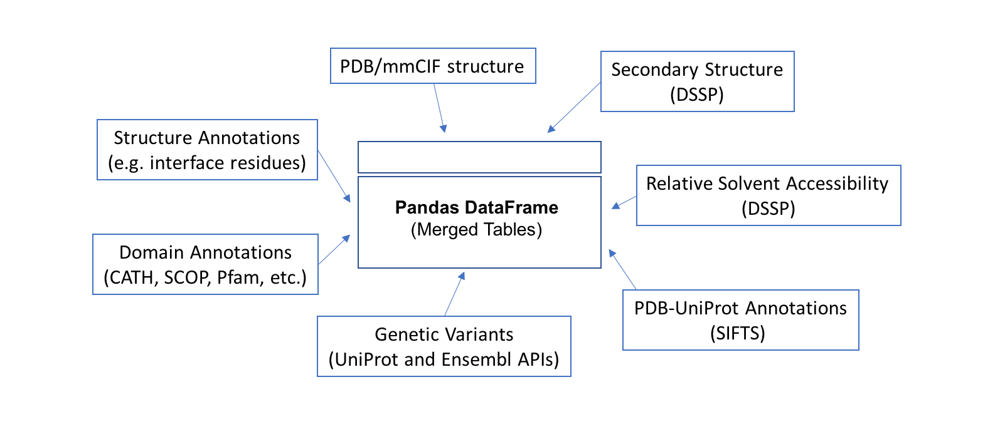

# ProIntVar Core
ProIntVar Core is a Python module that implements methods for working with protein structures (handles mmCIF, DSSP, SIFTS, protein interactions, etc.) and genetic variation (via UniProt and Ensembl APIs). 

ProIntVar core is now separated from ProIntVar-Analysis, which contains analysis scripts that use ProIntVar Core components. 


## Table of Contents

- [Key features](#key-features)
- [Overview](#overview)
- [Dependencies](#dependencies)
- [Installing](#installing)
- [Configuration](#configuration)
- [How to use](#how-to-use)
- [Additional Information](#additional-information)
  - [Project Structure](#project-structure)
  - [Guidelines on file names and extensions](#guidelines-on-file-names-and-extensions)
- [Licensing](#licensing)


## Key features

* Support for both reading and writing [PDB/mmCIF](http://mmcif.wwpdb.org/) structures
* [DSSP](http://swift.cmbi.ru.nl/gv/dssp/) runnning and parsing
* PDB-UniProt structure-sequence mapping with [SIFTS](http://www.ebi.ac.uk/pdbe/docs/sifts/index.html) (xml) parsing 
* Interface (contacts) computing and analysis with [Arpeggio](http://biosig.unimelb.edu.au/arpeggioweb/)
* Addition of Hydrogen atoms with [HBPLUS](http://www.ebi.ac.uk/thornton-srv/software/HBPLUS/) and [Reduce](http://kinemage.biochem.duke.edu/software/reduce.php)
* Download various raw files (structures, sequences, variants, etc.)
* Fetch data from several APIs (Proteins API, PDBe REST API, Ensembl REST, etc.)
* A TableMerger class that simplifies working with protein structures and sequence annotations
* All data is handled with [Pandas](http://pandas.pydata.org/) data structures


## Overview

ProIntVar handles data with aid of Pandas DataFrames. Data such as protein structures (sequence and atom 3D coordinates) and respective 
annotations (from structural analysis, e.g. interacting interfaces, secondary structure and solvent accessibility), as well as 
protein sequences and annotations (e.g. genetic variants, and other functional information) are handled by the classes/methods
so that each modular (components) table can be integrated onto a single 'merged table'.




The methods implemenented in `prointvar/merger.py` allow for the different components to be merged together onto a 
single Pandas DataFrame.

## Dependencies
Using Python 3.5+.

Check [requirements.txt](./requirements.txt) for all dependencies.


## Installing 

Setting up a virtual environment 
```sh
$ virtualenv --python `which python` env
$ source env/bin/activate
```

Installing ProIntVar

```sh
$ wget https://github.com/bartongroup/ProIntVar-Core/archive/master.zip -O ProIntVar-Core.zip
$ unzip ProIntVar-Core.zip
  
# alternatively
$ git clone https://github.com/bartongroup/ProIntVar-Core.git
  
# installing requirements
$ cd ProIntVar-Core
$ pip install -r requirements.txt
  
# then...  
$ python setup.py test
$ python setup.py install
```


## Configuration

Editing the provided template configuration settings
```sh
$ cd /path/to/desired/working/dir/
  
# Get a copy of the template config.ini file shipped with ProIntVar
$ ProIntVar-Core-config-setup new_config.ini
  
# Update the settings according to user preferences and push them
$ ProIntVar-Core-config-load new_config.ini
```

Testing that the new values are correctly loaded by ProIntVar
```sh
$ python
>>> from prointvar.config import config
>>> config.tmp_dir
'/new_config_path_to_tmp_dir/'
```


## How to use

TODO.


## Additional Information

### Project Structure

TODO

### Guidelines on file names and extensions
**PDB/PDBx/mmCIF Macromolecular structures**
* PDB and mmCIF formatted files are read and written from `db_pdbx` folder, as defined in the configuration file `config.ini`
    - PDB/mmCIF files are written as `<pdb_id>.pdb` or `<pdb_id>.cif`
    - BioUnits from PDBe are written as `<pdb_id>_bio.cif` 
    - New structure files written for running DSSP, Reduce, HBPLUS or Arpeggio are generally written as `<4char>_new.pdb` format
    - By-chain/entity structures are written as `<pdb_id>_<chain_id>.pdb`

**DSSP Secondary Structure**
* DSSP files are read and written from `db_dssp` folder  
    - DSSP files are generally written as `<pdb_id>.dssp`
    - By-chain/entity DSSP outputs are written as `<pdb_id>_<chain_id>.dssp`
    - Unbound-state DSSP are written as `<pdb_id>_unbound.dssp`

**SIFTS Structure-Sequence (PDB-UniProt) cross-reference**
* SIFTS files are read and written from `db_sifts` folder
    - SIFTS files are written as `<pdb_id>.xml`

**Arpeggio Interface Contacts**
* Arpeggio files are read and written from `db_contacts` folder
    - Arpeggio files are written as `<pdb_id>.contacts`, `<pdb_id>.amam`, `<pdb_id>.amri`, `<pdb_id>.ari` and `<pdb_id>.ri`

**HBPLUS Hydrogen-Bond Contacts**
* HBPLUS files are read and written from `db_contacts` folder
    - HBPLUS files are written as `<pdb_id>.h2b`
    - HBPLUS Hydrogen-filled PDBs are written as `<pdb_id>.h.pdb` in `db_pdbx`

**Reduce PDBs filled with Hydrogen**
* Reduce files are read and written from `db_pdbx` folder
    - Reduce Hydrogen-filled PDBs are written as `<pdb_id>.h.pdb` in `db_pdbx`


## Licensing
[GNU GPL3](LICENSE.md)
